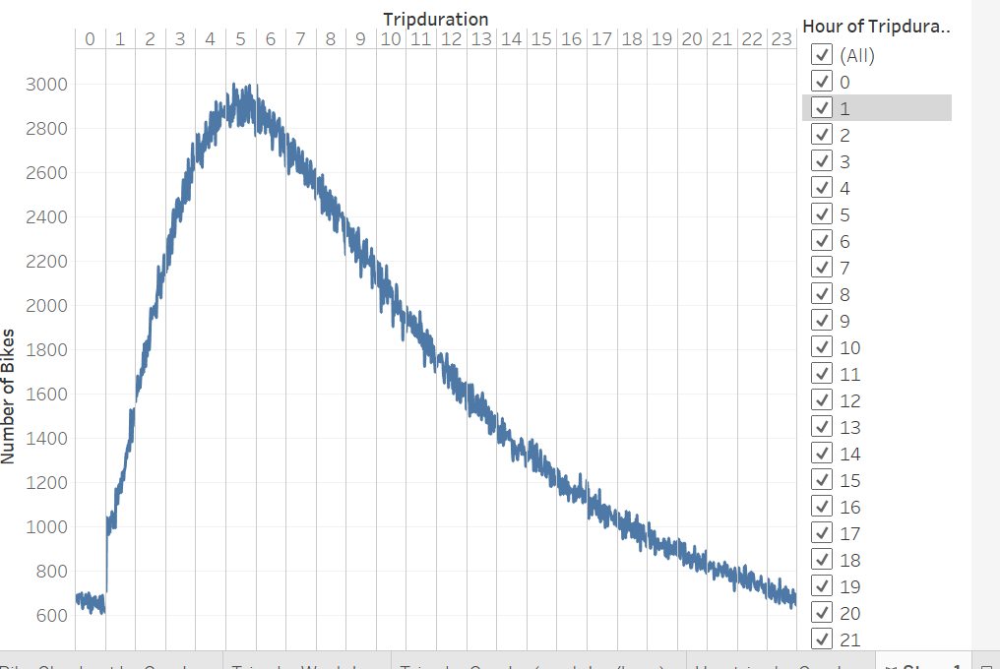

# Bikesharing

## Purpose
The purpose of this analysis was to show the length of time bikes were checked out by gender, the number of bike trips per rider and gender per hour, and the number of bike trips per user and gender for each day of week.

## Results

5 hours is the most common trip duration.

Males had the most amount of trips.

The most popular stoptimes were during the week between 8-9am and 5-7pm.

Males had the most rides with the largest amount of stoptimes during the week between 8-9am and 5-7pm.

Subsribers took the most amount of rides.

Male subscribers took the most rides.

The peak hours in August were 8-9am and 5-7pm. 

## Summary
Males had the largest amount of rides, especially the subscribers. The most popular times for a ride seem to be during rush hour on the weekdays (8-9am or 5-7pm). 

